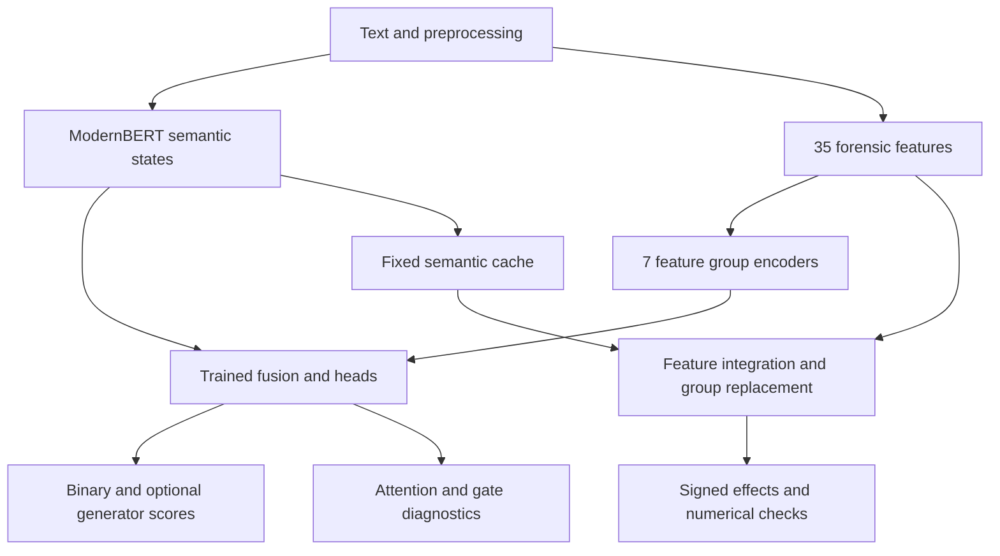

# FLAIRD explanation module

## Scope and objective

Phase one implements model-faithful, local explanations for the eight **already trained** FLAIRD variants. It introduces `src/flaird/utils/explain.py`, the `flaird-explain` command, and functional/numerical checks. Training, checkpoint weights, the feature extractor, fusion architecture, benchmark artifacts, and the Gradio interface are not changed. Interface design and comprehensive thesis/README documentation belong to the subsequent phases.

The research objective is to make the binary decision inspectable: what linguistic measurements were supplied, which feature groups received cross-attention, how the fusion gate behaved, and how changing forensic features affects the machine score while semantic evidence remains fixed. These are distinct questions and receive distinct outputs.

The detector predicts machine authorship. It does **not** determine whether a statement is false, whether its author intends to mislead, or whether multiple documents form a coordinated campaign. The thesis motivation concerns disinformation, but the implemented supervision is authorship and generator-family classification.

## Implemented architecture and explanation boundary

For a document, the inputs are token IDs and an attention mask, plus an ordered raw feature vector $x\in\mathbb{R}^{35}$. At the experiment setting of 512 tokens, the semantic branch can be truncated while the forensic branch measures the full input document.

The trained feature encoder applies

$$t_i(x)=\operatorname{sign}(x_i)\log(1+|x_i|),$$

then independently projects each group through Linear → GELU → LayerNorm → Dropout into a 128-dimensional group state. There are seven groups. ModernBERT-large supplies 1024-dimensional token representations. Mean pooling excludes masked padding; CLS pooling is supported by the model configuration.

In attention fusion, the normalized pooled semantic state is a single query. The seven normalized feature states are keys and values in eight-head cross-attention. If $s$ is the normalized semantic state and $c$ the normalized attention context,

$$g=\sigma(W_g[s;c]+b_g),\qquad m=c+g\odot(s-c),$$

$$h=\operatorname{FusionOutput}([m;s\odot c]).$$

The fusion output applies Linear → LayerNorm → GELU → Dropout. The shared prediction head applies Linear → GELU → LayerNorm before the binary classifier. Concatenation fusion instead concatenates the pooled semantic state with the mean feature-group state and applies its fusion output module; it has no attention or gate.

The binary classifier yields one logit $z$, with

$$p(\mathrm{machine})=\sigma(z),\qquad p(\mathrm{human})=1-\sigma(z).$$

Multitask variants additionally produce an independent softmax distribution over eleven labels: GPT, Meta-LLaMA, MPT, Cohere, Mistral, Gemini, DeepSeek, Falcon, Bison, Qwen, and human. This is not the conditional distribution $p(\mathrm{generator}\mid\mathrm{machine})$. Single-task variants return `null` for generator probabilities.



The explainer runs the encoder once under `no_grad`, detaches its output, and reuses the actual feature encoder, fusion, shared head, binary classifier, and optional generator classifier. It neither estimates a surrogate detector nor differentiates through ModernBERT. This supports both frozen and fine-tuned encoder checkpoints and reduces the cost of attribution substantially. It also means the result explains the **forensic branch conditional on semantic evidence**, not the entire document prediction.

## Three complementary explanation views

### 1. Raw measurements

Every feature row includes its canonical index, name, group, measured value, reference value, signed attribution, and magnitude rank. Raw values are not placed on a common importance scale: MTLD, entropy, punctuation ratios, and other measurements have different units and ranges. Ranking raw feature magnitudes would be misleading.

The canonical order comes from `FEATURE_NAMES` in `modeling/features.py`, and the loaded checkpoint supplies group names and indices. The explainer validates a complete, non-overlapping partition of all 35 indices. It rejects unsupported feature dimensions rather than silently assigning the wrong names.

| Indices | Group | Ordered measurements |
|---|---|---|
| 0–9 | lexical_diversity | ttr, root_ttr, log_ttr, mtld, yule_k, yule_i, hapax_ratio, dis_hapax_ratio, sichel_s, honore_r |
| 10–16 | function_word_style | determiner_ratio, preposition_ratio, conjunction_ratio, pronoun_ratio, auxiliary_ratio, function_word_ratio, function_word_diversity |
| 17, 21–24 | surface_composition | avg_word_length, vowel_consonant_ratio, digit_ratio, uppercase_ratio, whitespace_ratio |
| 18, 27, 28, 34 | structural_organization | avg_sentence_length_chars, sentence_length_cv, paragraph_length_cv, newline_density |
| 19, 20, 31–33 | punctuation_and_rhetoric | punctuation_density, punctuation_variety, question_density, exclamation_density, quote_density |
| 25, 26 | information_entropy | character_bigram_entropy, word_bigram_entropy |
| 29, 30 | repetition_and_burstiness | word_burstiness, repeated_bigram_ratio |

Most lexical, function-word, character, and entropy values are supplied by the existing `pystylometry` computations. Structural variation uses $\mathrm{CV}(l)=\mathrm{std}(l)/\mathrm{mean}(l)$ with NumPy's population standard deviation and zero for an undefined denominator. The implemented `word_burstiness` is CV over per-word frequency counts, not temporal inter-arrival burstiness. `repeated_bigram_ratio` counts distinct bigram types occurring more than once divided by the number of distinct bigram types. Question/exclamation density is per regex-derived sentence, while quote/newline density is per regex-derived word.

The extractor converts nonfinite values to zero and can fall back to zero for library-derived metrics on extremely short inputs. A zero measurement is therefore not necessarily evidence that a phenomenon is absent. The current extractor uses surface/lexical statistics; it does not implement all the syntactic, discourse, readability, or perplexity components named in the proposal. Explanations only describe implemented measurements.

### 2. Integrated gradients on forensic features

Let $S$ be the cached semantic representation and define the scalar function

$$F_S(x)=z_{\mathrm{machine}}(S,x).$$

For a reference vector $b$ and a straight path in **raw-feature coordinates**, feature $i$ receives

$$\mathrm{IG}_i(x;b,S)=(x_i-b_i)\int_0^1\frac{\partial F_S(b+\alpha(x-b))}{\partial x_i}\,d\alpha.$$

The derivative includes the trained signed-log transformation, feature projection, fusion, and classification head. Positive attribution increases the machine logit relative to the reference; negative attribution decreases it. The signs retain this meaning even when the final decision is human. An attribution is in logit units, not probability points.

The target is the logit rather than sigmoid probability because sigmoid saturation can suppress gradients for confident predictions. The generator head is reported as context; these attributions do not explain its individual class scores.

Gauss–Legendre quadrature approximates the integral:

$$\widehat{\mathrm{IG}}_i=(x_i-b_i)\sum_{j=1}^{K} w_j\frac{\partial F_S(b+\alpha_j(x-b))}{\partial x_i},\qquad 0<\alpha_j<1.$$

Interior nodes avoid the endpoints where the implementation of `sign(x)*log1p(abs(x))` has problematic autograd behavior at exactly zero. They do not remove all numerical difficulties or make arbitrary paths through feature space natural documents.

The default is $K=64$ nodes, in chunks of eight. If the completeness criterion fails, $K$ doubles to 128, 256, 512, then at most 1024, recomputing the integral each time. An explicitly configured cap can be larger. The diagnostic records every attempted node count and residual; the system never silently rescales attributions to force completeness.

For each result,

$$r=F_S(x)-F_S(b)-\sum_i\widehat{\mathrm{IG}}_i,$$

$$\mathrm{pass}\iff |r|\leq \epsilon_{\mathrm{abs}}+\epsilon_{\mathrm{rel}}|F_S(x)-F_S(b)|.$$

Defaults are $\epsilon_{\mathrm{abs}}=0.001$ and $\epsilon_{\mathrm{rel}}=0.01$. A failed criterion leaves the result available with a warning; downstream interfaces should prominently flag it. Completeness tests an aggregate numerical identity, not the stability of every feature rank, fairness, causal validity, or calibration.

Group attribution is the signed sum over its constituent features:

$$\mathrm{IG}_G=\sum_{i\in G}\mathrm{IG}_i.$$

Features remain in canonical index order and receive a separate rank by absolute attribution. This supports a stable measurement table and a separate ranked contribution chart without mixing their semantics.

### 3. Group replacement and fusion diagnostics

For group $G$, let $x^{(G\leftarrow b)}$ replace only its raw features with reference values. The reported effects are

$$\Delta_G^{z}=F_S(x)-F_S(x^{(G\leftarrow b)}),$$

$$\Delta_G^{p}=\sigma(F_S(x))-\sigma(F_S(x^{(G\leftarrow b)})).$$

A positive delta means the observed group raises the machine score relative to the replacement. All groups are evaluated together in one tail batch. Replacement keeps the semantic representation fixed and replaces measurements, not words. Its deltas need not add up because fusion is nonlinear and groups interact. Disagreement with IG rankings can reflect interactions, baseline choice, and the distinction between a simultaneous path and one-group-at-a-time intervention.

For attention models, `groups[].attention` is the actual head-averaged cross-attention weight over the seven groups. It sums approximately to one in evaluation mode. There is one pooled semantic query, so this is **not token attention**, token saliency, or a word-to-word heatmap.

`mean_semantic_gate` is the arithmetic mean of the hidden-coordinate gate vector. Larger values indicate a stronger semantic preference in that intermediate interpolation, but downstream multiplication, projection, and normalization prevent treating it as a percentage of the final prediction. It is not an additive semantic-versus-forensic attribution.

Concatenation models return `null` for attention and mean gate. A future interface should omit these charts or mark them unavailable, not substitute zero or invent a gate.

## Reference selection and interpretation limits

The default $b=0$ is a transparent numerical reference. Biases and normalization remain active, so baseline logits need not be zero, baseline probabilities need not be 0.5, and the forensic branch is not removed. Zero is not a typical human document. Correlated features interpolated independently can produce vectors that no real document realizes.

For research analyses, pass an ordered 35-value reference estimated from the **training split only**, such as a documented training median vector. Record the reference construction, population, feature order, and dataset revision. Human-only references answer a different question from a mixed-population reference. Compare multiple references and attribution convergence before treating a rank as robust. Never construct a reference using held-out labels to improve a reported explanation.

Feature IG leaves the semantic branch unchanged. Thus

$$F_S(x)=F_S(b)+\sum_i\mathrm{IG}_i+r$$

is a conditional decomposition around a semantic-plus-reference prediction. It does not allocate the entire prediction to 35 linguistic measurements or to individual words. Attention alone also does not establish feature importance; this design reports it separately from signed effects.

## Preprocessing and truncation

The preparation notebook normalizes email addresses, user mentions, and a phone-number regex before extracting features. Training tokenizes that stored text without an additional normalization pass. The current demo also normalizes both branches. TIRA's default collator normalizes token text but extracts features from the original string when no stored feature column is used.

`explain_text` therefore exposes three explicit policies:

| Policy | Semantic tokens | Feature measurements | Intended comparison |
|---|---|---|---|
| `training` (default) | Normalized text | Same normalized text | Notebook preparation and current demo |
| `tira` | Normalized text | Original text | Current TIRA collator without stored features |
| `none` | Supplied text | Supplied text | Raw inference, or already normalized stored RAID text |

The prepared RAID feature test split contains normalized `generation` and matching stored features. Its training-notebook submission command disables another preprocessing pass. If explaining an existing prediction with stored features, use `explain_inputs` with its exact token IDs, mask, and feature vector. That is the strongest route to matching the actual inference inputs.

The token limit defaults to 512. Metadata records the count before truncation, tokens used, chosen policy, full-document forensic scope, and whether semantic truncation occurred. Full-text features are retained after token truncation to preserve trained behavior. No sentence trimming, whitespace cleanup beyond the existing preprocessing function, or zero-width character removal is added.

## Python usage

Install an appropriate PyTorch build, then the package and test extras:

```bash
python -m pip install torch
python -m pip install -e '.[test]'
```

Load the trained checkpoint with its published custom architecture, using the same AutoModel path as the existing inference scripts:

```python
from transformers import AutoModelForSequenceClassification, AutoTokenizer
from flaird.utils.explain import ExplanationOptions, FlairdExplainer

model_id = 'MahmoodAnaam/flaird-modernbert-large-attention-multitask'
# Set revision to the desired immutable Hub commit for repeatable analyses.
revision = None
model = AutoModelForSequenceClassification.from_pretrained(
    model_id, revision=revision, trust_remote_code=True
)
model = model.float().eval()
tokenizer = AutoTokenizer.from_pretrained(
    model_id, revision=revision, trust_remote_code=True
)
explainer = FlairdExplainer(model, ExplanationOptions())
result = explainer.explain_text('An English document to investigate.', tokenizer)
report = result.to_dict()
ranked = sorted(report['features'], key=lambda row: row['rank'])
```

`model.to('cuda')` is optional; the explainer uses the feature encoder's device and dtype. Float32 is recommended. Frozen encoders remain frozen. Existing parameter gradients remain untouched because `torch.autograd.grad` targets only the feature path. The caller must call `eval()` for all modules. The implementation rejects training mode and `torch.inference_mode()`; ordinary `torch.no_grad()` is supported because the integration loop explicitly enables gradients.

For exact supplied inputs:

```python
result = explainer.explain_inputs(
    input_ids=batch['input_ids'],
    attention_mask=batch['attention_mask'],
    forensic_features=batch['forensic_features'],
    baseline_features=None,  # or an ordered empirical reference
)
```

Only one document is accepted per explanation. Integration is internally batched. The interface should queue requests on a shared model and avoid changing device placement or training flags during requests.

## Command-line usage

```bash
flaird-explain \
  --model MahmoodAnaam/flaird-modernbert-large-attention-multitask \
  --text-file input.txt \
  --output explanation.json \
  --preprocessing training \
  --max-length 512 \
  --integration-steps 64 \
  --max-integration-steps 1024
```

The equivalent source-tree entry point is `PYTHONPATH=src python -m flaird.scripts.explain`. Use `--revision COMMIT_SHA` to pin model and tokenizer, `--device cuda` for an available GPU, and `--baseline-file reference.json` for a JSON array in canonical feature order. `--integration-batch-size` controls tail memory usage. JSON does not export the original document; it contains numerical measurements and metadata. The output file is replaced when the same path is supplied again.

The CLI loads float32 weights and does not train, push checkpoints, or modify Hub repositories. A completeness warning is printed to stderr and recorded in JSON; the numerical result can still be inspected.

## Result contract for the next Gradio phase

| Field | Contents | Recommended presentation |
|---|---|---|
| `prediction` | Binary logit, machine/human probabilities, threshold, decision, optional auxiliary distribution | Probability summary and independent generator bars |
| `features` | 35 canonical measurement rows, signed IG, absolute rank | Full table and diverging signed top-feature bars |
| `groups` | Signed IG sum, optional attention, replacement logits and deltas | Separate attention bars, contribution bars, and replacement-effect plot |
| `diagnostics` | Reference score, attribution sum, residual/tolerance, convergence attempts, optional mean gate | Explicit numerical-quality indicator and diagnostic gate display |
| `metadata` | Schema, target, method, model ID/revision, dtype/device, settings, token scope | Reproducibility details and truncation notice |
| `warnings` | Baseline, conditional interpretation, calibration and scope limitations | Contextual explanation notes |

Version 1 targets `machine_logit`. Probabilities are model outputs, not calibrated guarantees. The decision uses a strict `score > threshold` rule, consistent with the repository evaluator's binary threshold direction. At exactly the threshold it returns human; it does not implement PAN's unanswered-score policy. Explain and score policies should remain distinguishable in the UI.

## Validation and reproducibility

Run the offline suite with `python -m pytest tests -q`. It includes an independent linear oracle with exact signed attributions and group deltas, all eight architectural combinations with actual small ModernBERT models, prediction equality to the original forward pass, attention/gate equality, generator handling, signed-feature baselines, deterministic repeat calls, unchanged weights/flags/parameter gradients, single encoder evaluation, numerical failure reporting, integration chunk invariance, explicit preprocessing/truncation, actual feature extraction on all 20 examples, and CLI export from a saved local checkpoint.

The opt-in trained-weight check is:

```bash
PYTHONPATH=src python tests/validate_explanation_checkpoints.py \
  --output docs/validation/explanation-checkpoints.json
```

It downloads the eight configured checkpoints, runs all 20 demo examples per checkpoint, compares the explanation score with an independent full forward call, checks finite JSON and completeness, and records immutable Hub revisions and package versions. It performs no training. Its example labels and attack names are provenance only; these 20 curated examples are not a new benchmark or an unbiased accuracy estimate. The committed report and [phase-one review](PHASE_ONE_REVIEW.md) document the validation actually executed.

## Limitations and future research

1. Evaluate baseline sensitivity and individual-rank convergence, including multiple training references and bootstrap stability.
2. Add token or sentence interventions with recomputation of both branches; compare them with conditional feature effects rather than presenting them as interchangeable.
3. Add generator-class attributions with a clearly specified target, and assess auxiliary calibration and open-set generator behavior.
4. Validate explanation faithfulness through feature/group perturbation studies on held-out documents, with checks for out-of-distribution reference vectors.
5. Audit preprocessing alignment across training, TIRA, RAID, and deployment before comparing score distributions. Existing runs must retain their original provenance.
6. Investigate calibration and operating thresholds per deployment domain using an independent validation set. RAID's domain-specific FPR thresholds do not justify applying a universal deployment threshold.
7. Extend only after validation to multilingual text, actual fact-checking evidence, or document-level campaign analysis; these are not outputs of the current detector.

## References

- Sundararajan, Taly, and Yan (2017). [Axiomatic Attribution for Deep Networks](https://proceedings.mlr.press/v70/sundararajan17a.html). Integrated gradients and completeness motivate the attribution layer.
- Jain and Wallace (2019). [Attention is not Explanation](https://aclanthology.org/N19-1357/). Motivation for keeping attention diagnostics separate from feature-effect claims.
- Wiegreffe and Pinter (2019). [Attention is not not Explanation](https://aclanthology.org/D19-1002/). Attention interpretability requires explicit hypotheses and empirical checks.
- Implementation sources: `modeling_flaird.py`, `modeling_fusion.py`, `features.py`, `data_collator.py`, and `notebooks/flaird_dataset_preparation.ipynb` in this repository.
