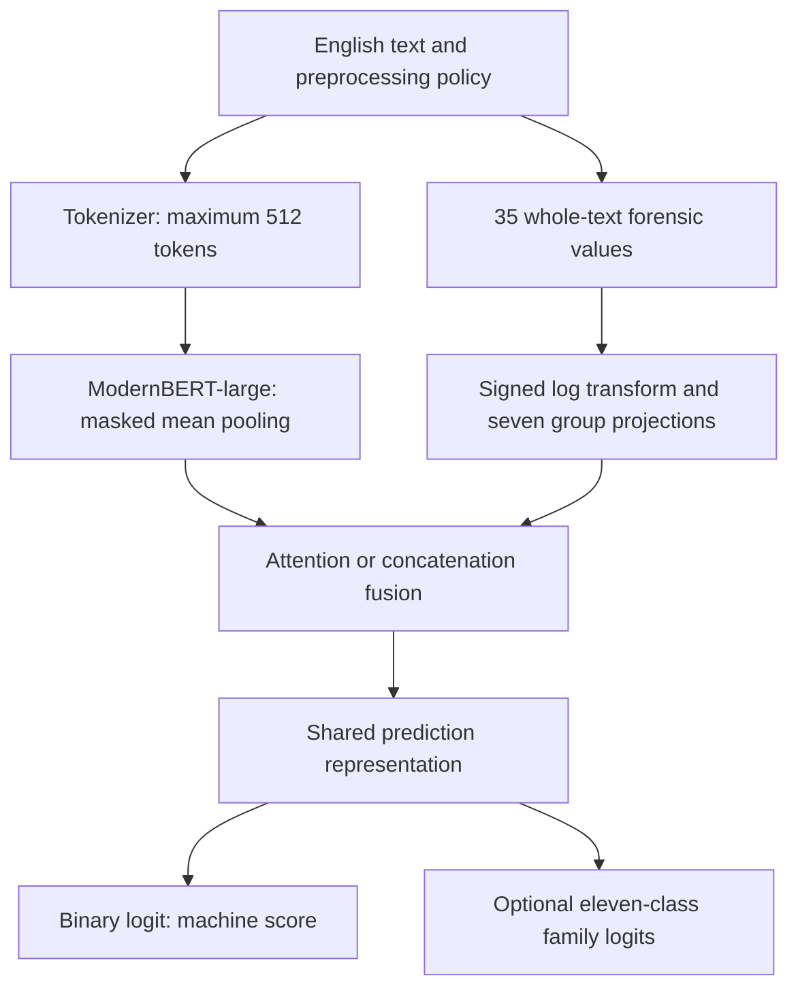

# FLAIRD model architecture and input/output contract

FLAIRD combines a contextual encoder with 35 deterministic forensic-linguistic measurements. The implemented task is English human-versus-machine origin detection, optionally regularized by an eleven-class generator-family task. Detecting coordinated disinformation, factual accuracy or an author's intent requires additional evidence outside this model.

The authoritative implementation is [configuration](../src/flaird/modeling/configuration_flaird.py), [features](../src/flaird/modeling/features.py), [fusion](../src/flaird/modeling/modeling_fusion.py) and [model](../src/flaird/modeling/modeling_flaird.py). All eight trained variants use ModernBERT-large, a 1,024-dimensional encoder representation, seven 128-dimensional feature tokens and a 512-token experiment limit. ModernBERT's longer native context does not imply that these checkpoints were trained or evaluated at that longer length.

## Computation graph

| Tensor | Shape | Meaning |
| --- | --- | --- |
| `input_ids` | B × L | Token IDs, L ≤ 512 in the experiments |
| `attention_mask` | B × L | Padding mask for encoder and semantic pooling |
| `forensic_features` | B × 35 | Raw ordered finite values; model transforms them internally |
| Encoder states | B × L × 1024 | Contextual token representations |
| Feature states | B × 7 × 128 | Learned group representations |
| Fused state | B × 1024 | Shared input to prediction head |
| `labels` | B | Training targets: 0 human, 1 machine |
| `generator_labels` | B | Training family indices 0–10 |
| `logits` | B × 1 | Binary machine-origin logit |
| `generator_logits` | B × 11 or `None` | Auxiliary logits; absent in single-task variants |
| Attention diagnostic | B × 7 or `None` | Mean across eight attention heads |
| Gate diagnostic | B or `None` | Mean across 1,024 gate coordinates |

Both token IDs and forensic values are mandatory. A generic text-classification pipeline that only supplies token IDs is insufficient. The configuration's `id2label={0: "machine"}` names the sole **output-logit index**; it does not change the binary training target mapping, where 0 is human.

## Canonical feature inventory

Feature indices are part of the checkpoint interface. Never alphabetically sort a feature dictionary before tensor construction. The implementation's `FEATURE_NAMES` sequence determines the order.

| Index | Name | Operational meaning |
| --- | --- | --- |
| 0 | `ttr` | Vocabulary types / word tokens |
| 1 | `root_ttr` | Types / square root of tokens |
| 2 | `log_ttr` | Log(types) / log(tokens), with library edge handling |
| 3 | `mtld` | Average forward/backward measure of textual lexical diversity |
| 4 | `yule_k` | Vocabulary frequency concentration |
| 5 | `yule_i` | Vocabulary diversity from the Yule frequency denominator |
| 6 | `hapax_ratio` | Once-occurring types / tokens, aggregated by library |
| 7 | `dis_hapax_ratio` | Twice-occurring types / tokens, aggregated by library |
| 8 | `sichel_s` | Twice-occurring types / vocabulary types |
| 9 | `honore_r` | Log-length-adjusted hapax vocabulary diversity |
| 10 | `determiner_ratio` | Library determiner-list occurrence ratio |
| 11 | `preposition_ratio` | Library preposition-list occurrence ratio |
| 12 | `conjunction_ratio` | Library conjunction-list occurrence ratio |
| 13 | `pronoun_ratio` | Library pronoun-list occurrence ratio |
| 14 | `auxiliary_ratio` | Library auxiliary-list occurrence ratio |
| 15 | `function_word_ratio` | Total library function-word occurrence ratio |
| 16 | `function_word_diversity` | Distinct function words / function-word occurrences |
| 17 | `avg_word_length` | Library average word length |
| 18 | `avg_sentence_length_chars` | Library average sentence length in characters |
| 19 | `punctuation_density` | Library punctuation occurrence density |
| 20 | `punctuation_variety` | Library punctuation-type variety |
| 21 | `vowel_consonant_ratio` | Library vowel/consonant composition ratio |
| 22 | `digit_ratio` | Library digit proportion |
| 23 | `uppercase_ratio` | Library uppercase proportion |
| 24 | `whitespace_ratio` | Library whitespace proportion |
| 25 | `character_bigram_entropy` | Mean chunk-level character-bigram entropy in bits |
| 26 | `word_bigram_entropy` | Mean chunk-level word-bigram entropy in bits |
| 27 | `sentence_length_cv` | Population CV of whitespace word counts per sentence segment |
| 28 | `paragraph_length_cv` | Population CV of whitespace word counts per paragraph |
| 29 | `word_burstiness` | Population CV of word-type occurrence counts |
| 30 | `repeated_bigram_ratio` | Fraction of distinct word bigrams occurring more than once |
| 31 | `question_density` | Number of `?` / max(1, sentence segments) |
| 32 | `exclamation_density` | Number of `!` / max(1, sentence segments) |
| 33 | `quote_density` | Counts of straight/curly double quotes / max(1, regex words) |
| 34 | `newline_density` | Newline characters / max(1, regex words) |

The first 27 measurements delegate to `pystylometry`; its tokenizer, lists, rounding, chunking and special cases are part of their definition. In inspected version 1.4.3, Yule/hapax and entropy statistics are chunk aggregates with default 1,000-word chunks. Their formulas describe each chunk, not necessarily a single whole-document calculation. With N tokens, V types and Vₘ types appearing m times:

$$K=10^4\frac{\sum_m m^2V_m-N}{N^2},\qquad I=\frac{V^2}{\sum_m m^2V_m-N}.$$

$$Hapax=\frac{V_1}{N},\quad DisHapax=\frac{V_2}{N},\quad S=\frac{V_2}{V},\quad R=\frac{100\ln N}{1-V_1/V}.$$

For a bigram distribution π, entropy is $-\sum_b\pi_b\log_2\pi_b$. MTLD accumulates lexical-diversity factors in forward and reverse directions using the library's defaults; it is not a reading-comprehension score.

Custom features use lowercase regex words `\b[\w'-]+\b`, nonempty sentence segments split by `[.!?]+`, and nonempty paragraphs split by `\n\s*\n`. Their coefficient of variation is population standard deviation / mean, returning zero for an empty list or zero mean. `word_burstiness` measures variation among **type frequencies**, not temporal word inter-arrival burstiness. Repetition counts repeated distinct bigram types, not the fraction of all bigram occurrences that repeat.

The extractor catches `ValueError` and `ZeroDivisionError` around the entire library block. If any library computation fails, all delegated fields become zero, while custom fields still run. Missing, nonnumeric and nonfinite values also become zero. Thus a zero may indicate a fallback, not linguistic absence. This matters especially for very short text.

These surface and lexical proxies do not implement dependency parsing, discourse relations, semantic coherence analysis or token attribution. Their names should not be used to imply those capabilities.

## Group encoder and rationale

| Group | Feature indices | Motivation |
| --- | --- | --- |
| Lexical diversity | 0–9 | Vocabulary richness and repetition |
| Function-word style | 10–16 | Relatively topic-light usage patterns |
| Surface composition | 17, 21–24 | Character and word composition |
| Structural organization | 18, 27, 28, 34 | Length variability and layout |
| Punctuation and rhetoric | 19, 20, 31–33 | Punctuation and rhetorical surface cues |
| Information entropy | 25, 26 | Local distributional variety |
| Repetition and burstiness | 29, 30 | Frequency concentration and repeated phrases |

For raw feature vector x, the model first computes $z_i=\operatorname{sign}(x_i)\log(1+|x_i|)$. This compresses high-range values without discarding sign. It is neither a dataset z-score nor a percentile transform. Each group g produces

$$f_g=Dropout\big(LayerNorm(GELU(W_g z_{I_g}+b_g))\big),\qquad f_g\in\mathbb R^{128}.$$

Projection dropout is 0.1. Group tokens provide an explicit organization for fusion and diagnostics, but the grouping alone does not establish independent or causal linguistic factors.

## Semantic pooling and fusion alternatives

The semantic branch uses masked mean pooling:

$$s=\frac{\sum_{t=1}^{L}m_t H_t}{\max(1,\sum_t m_t)}.$$

A `cls` pooling option exists in configuration, but the experiment defaults use `mean`. Attention fusion layer-normalizes s and feature tokens. In each of eight heads, one semantic query attends to the seven feature tokens through learned projections:

$$A_h=softmax\left(Q_hK_h^\top/\sqrt{d_h}\right),\qquad c=LayerNorm\big(MHA(s,F,F)\big).$$

The returned group attention averages heads. In evaluation mode its weights sum to one across seven groups. The gate is dimension-wise:

$$g=\sigma(W_g[s;c]+b_g),\qquad m=c+g\odot(s-c),$$

$$u=Dropout\left(GELU\left(LayerNorm\left(W_o[m;s\odot c]+b_o\right)\right)\right).$$

A larger coordinate of g shifts that mixed coordinate toward s. The reported scalar is only mean(g); it is not a probability that the semantic branch caused the prediction, nor an additive decomposition of the output.

Concatenation fusion pools feature tokens equally, $\bar f=\frac17\sum_g f_g$, then projects $[s;\bar f]\in\mathbb R^{1152}$ through Linear → LayerNorm → GELU → Dropout to a 1,024-dimensional u. It has no attention weights or gate. The explanation interface correctly marks these diagnostics unavailable while still providing forensic attributions and interventions.

The shared prediction representation applies Linear → GELU → LayerNorm. Separate dropout/linear heads emit the binary logit and, when enabled, family logits. Output scores are

$$p_{machine}=\sigma(\ell),\quad p_{human}=1-p_{machine},\quad q_c=softmax(v)_c.$$

The family head is independent of the binary head and includes human. Their outputs can disagree. Weighted training means the binary sigmoid is a model score; population calibration is not established. [Training experiments](TRAINING_EXPERIMENTS.md) gives the losses and implications.

## Trained-checkpoint usage

Always load a trained checkpoint through `AutoModelForSequenceClassification` and `AutoTokenizer` with `trust_remote_code=True`. Pin a verified revision for controlled comparisons. Supply forensic vectors in canonical order, preserve the preprocessing policy and token limit, use evaluation mode and avoid applying the signed-log transform twice. See the executable minimal example in [Reproducibility](REPRODUCIBILITY.md).

Model output includes `loss` when labels are supplied and requested internal `fusion_states` when `output_fusion_states=True`. Feature gradients in explanations require evaluation mode but enabled autograd for the feature branch; a blanket `torch.no_grad()` around explanation computation is inappropriate.

## Interpretation and future extensions

[The explanation module](EXPLANATION_MODULE.md) implements feature integrated gradients, group baseline interventions, attention/gate diagnostics and completeness checks. It holds semantic evidence fixed for forensic attribution. Its zero-feature baseline is a numerical reference, not a real human text; an intervention can leave the training manifold. Attention describes routing rather than causal importance. Positive forensic attribution increases the machine logit relative to that baseline, not a universal judgment that a linguistic trait is machine-written.

Next architectural studies should compare encoder-only, forensic-only, feature-group removal and attention-head variants; none of those additional baselines are present among the eight completed runs. Longer context, multilingual extraction and syntactic/discourse features require new training/evaluation rather than changing runtime settings and reusing old benchmark claims.

## References

- Warner et al., [ModernBERT](https://arxiv.org/abs/2412.13663), 2024; [base encoder](https://huggingface.co/answerdotai/ModernBERT-large).
- [pystylometry source](https://github.com/craigtrim/pystylometry), whose installed 1.4.3 implementation was inspected for the delegated definitions.
- Sundararajan et al., [Axiomatic Attribution for Deep Networks](https://proceedings.mlr.press/v70/sundararajan17a.html), 2017.
